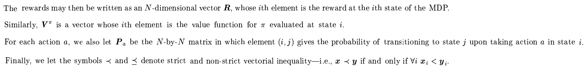

# Summary
## Abstract  
 This paper addresses the problem of inverse reinforcement learning (IRL) in Markov decision processes, that is, the problem of extracting a reward function given 
observed, optimal behavior.   
 It derives three algorithms for IRL. The first two deal with the case where the entire policy is known; it handles tabulated reward functions 
on a finite state space and linear functional approximation of the reward function over a potentially infinite state space. The third algorithm deal with the more 
realistic case in which the policy is known only through a finite set of observed trajectories. (**In reality, basically states are infinite. So it deals with infinite states
set**)   
 In all cases, a key issue is degeneracy - the existence of a large set of reward functions for which the observed policy is optimal. (**It means that there are many 
reward functions that make expert trajectories optimal. So it is important which we choose.**) It suggests how to choose plausible(such as optimal) reward function.  

## Introduction  
From charanterized IRL problem, they identify some sources of motivation.  
1) Reward function is unknown, and it can be ascertained through empirical investigation, such as bee's 
foraging behavior. We don't know how bee weights nectaringestion against various things, such as flight distance, time and risk from wind and so on.  
2) Agent designer may have only a very rough idea of optimal behaviors, so it is not useful to use straightforward reinforcement learning. We cam use epert traj data which
can be information of reward function, and use it for training, so it can be called **imitation learning** and **apprenticeship learning**. From those data, actor recover expert's reward function 
adn to use it to generate desirable behavior. So actor directly related with reward fuction, so it is the most robust definition of the task.   
(**It sees expert function as reward fuction. Therefore expert function is based on its reward function(which they thinks it is optimal)**)  

It uses finite Markov decision processes(MDPs) for addressing IRL problem to computational task and being more familiar to the machine learning community. (There were no past research, so it is the first try)   

## Notation and Problem Formulation  

  

For discrete, finite spaces, all these functions can be represented as vectors indexed by state. 

  
  

## Basic Properties of MDPs  
### Theorem 1(Bellman Equations)

  
  

### Theorem 2(Bellman Optimality)

  
  

## Inverse Reinforcement Learning

# Reference
* Algorithms for Inverse Reinforcement Learning: http://ai.stanford.edu/~ang/papers/icml00-irl.pdf 
 It tries to make IRL problem to computational tasks by using RL on imitation learning or appenticeship learning, and MDPs.  

* 
