# Linear Programming

# Summary
## Abstract  
 This paper addresses the problem of inverse reinforcement learning (IRL) in Markov decision processes, that is, the problem of extracting a reward function given observed, optimal behavior.   
 It derives three algorithms for IRL. The first two deal with the case where the entire policy is known; it handles tabulated reward functions on a finite state space and linear functional approximation of the reward function over a potentially infinite state space. The third algorithm deal with the more realistic case in which the policy is known only through a finite set of observed trajectories. (**In reality, basically states are infinite. So it deals with infinite states set**)   
 In all cases, a key issue is degeneracy - the existence of a large set of reward functions for which the observed policy is optimal. (**It means that there are many reward functions that make expert trajectories optimal. So it is important which we choose.**) It suggests how to choose plausible(such as optimal) reward function. 
 
 **Its contributions are that**  
 1) It addresses IRL problem to computational task by using finite Markov decision processes(MDPs), and it is more familiar to the machine learning community.  
 2) they give a simple characterization of the set of all reward functions for which a given policy is optimal.  
 3) The reward function set contains degenerate solutions, so they propose a simple heuristic for removing this degeneracy, resulting in a linear programming solutiuon to the IRL problem.

## 1. Introduction  
From charanterized IRL problem, they identify some sources of motivation.  
1) Reward function is unknown, and it can be ascertained through empirical investigation, such as bee's 
foraging behavior. We don't know how bee weights nectaringestion against various things, such as flight distance, time and risk from wind and so on.  
2) Agent designer may have only a very rough idea of optimal behaviors, so it is not useful to use straightforward reinforcement learning. We cam use epert traj data which
can be information of reward function, and use it for training, so it can be called **imitation learning** and **apprenticeship learning**. From those data, actor recover expert's reward function 
adn to use it to generate desirable behavior. So actor directly related with reward fuction, so it is the most robust definition of the task.   
(**It sees expert function as reward fuction. Therefore expert function is based on its reward function(which they thinks it is optimal)**)  

It uses finite Markov decision processes(MDPs) for addressing IRL problem to computational task and being more familiar to the machine learning community. (There were no past research, so it is the first try)   

## 2. Notation and Problem Formulation  

 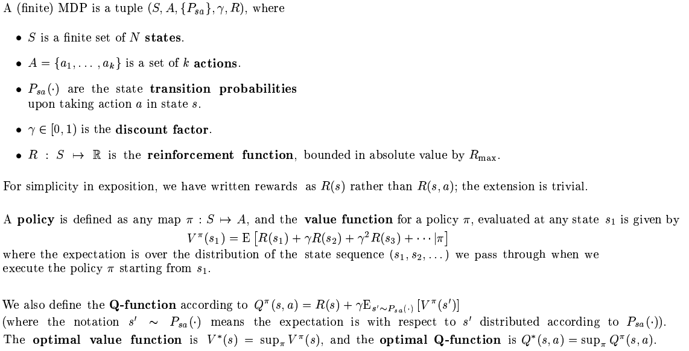 

For discrete, finite spaces, all these functions can be represented as vectors indexed by state. 

 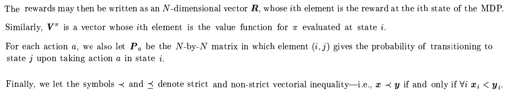 
  

### 2.1 Basic Properties of MDPs  

 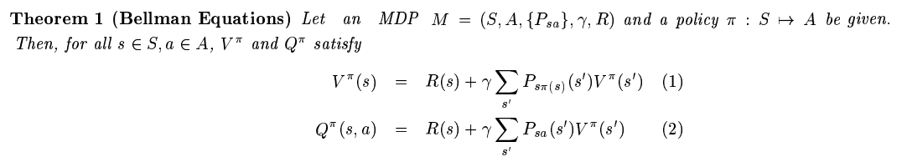 
  

 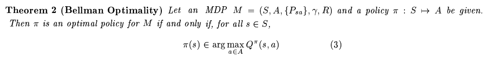 
  

### 2.2 Inverse Reinforcement Learning  
The inverse reinforcement learning problem is to find a reward function that can explain observed behavior. optimal policy π is given and, they wish to find the set of possible reward functions R that makes given π is optimal. **Be careful that reward functions that satisfy given π is optimal are not unique!** For simplicity, they assume policy is deterministic.  

## 3. IRL in Finite State Spaces  
1) they give a simple characterization of the set of all reward functions for which a given policy is optimal
2) The reward function set contains degenerate solutions, so they propose a simple heuristic for removing this degeneracy, resulting in a linear programming solutiuon to the IRL problem.

### 3.1 Characterization of the soultion set  
Why need characterization of the solution set? Because it is the reason why expert chooses those action. If we know the states' characterization, actor can choose the plausible action when it encounters strange state. It is only needed when state are infinite. Because if state space is finite, actor shows good performance when it remember all states.  

Their main result characterizing the set of solutions is the follwing:  

 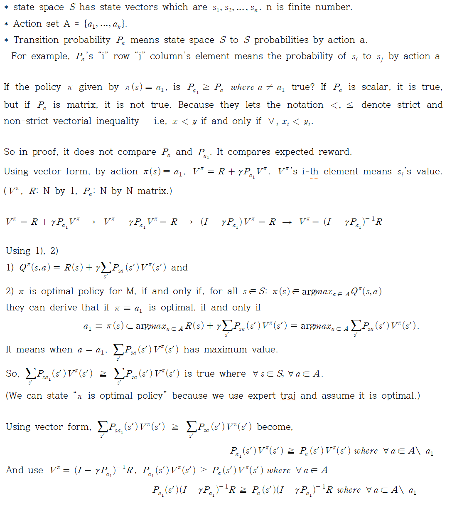 
  

* Key points of that are 
1) (I - γPa1) is always invertible (I don't understand why it has no zero eigenvalues.)
2) Remark: (Pa1−Pa)(I−γPa1)−1R≻0 is necessary and sufficient for π ≡ a1 to be unique optimal policy. Proof: Let's think about its original form: P_a1 V^π >= P_a V^π. From that form, if π is optimal, π(s) ≡ a1's 's' element in P_a1, V^π has the biggest value. So We can easily think that P_a1 V^π > P_a V^π is true when optimal π(s) ≡ a1.  

* Theorem 3 result should be satisfied, when we solve IRL. It means Reward functions should satisfy that formula and it functions as constraint. But there are some problems.   
1) If Reward function = 0, it satisfies Theorem 3 result. So it always become a solution. But why R = 0 can be a solution? It because in optimal π(s) ≡ a form action a can be any action. In other words π give same probabilities on all of actions, so any action becomes optimal action.    

2) There are too many Reward functions that meet the criteria(Theorem 3 result). We should decide one of them. But how?  

### 3.2 LP Formulation and Penalty Terms.  
Paper suggests Linear Programming for solving those problems. It suggests the method for choosing reward function.  
1) Find R(reward function) that makes π optimal. And favor solution that make any single step deviation from π as costly as possible.  
It means that choose R that costly penalize policy on devation from π. In other words, choose R which is the most strict one. 

We can choose specific R from that equation: 

 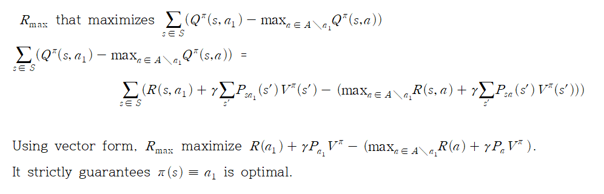 
    

2) All other things being equal, solutions with mainly small rewards are simpler and therefore preferable, so for implementing this, it adds to the objective function a weight decay like penalty term such as "-λ||R||". It is important to select appropriate λ. Because λ is too large, R will be nonzero in only a few states. λ is too small, R will be infinite. In this paper, it find the appropriate λ automatically by using binary search. 

___
**Q. How to use binary search for finding λ?**
A. First start large λ and calculate R. If R almost has zero on most of state, update λ_t+1. If R has large values on most of state, update λ_t+1. Repeat it, until R is not zero everywhere and not has too large values.      

___

Reflect 1), 2) to Theorem 3 result, it redefines that

 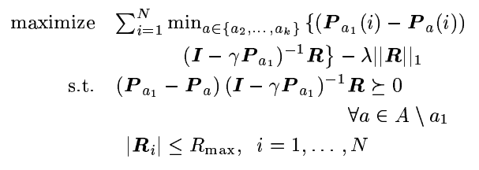 
 

## 4. Linear Function Approximation in Large state spaces  
In this section, they consider the case of infinite state spaces. they restrict themselves to the case of S = R^n (n-dimension). R is a function from S = R^n into the reals.   
Because of infinite states, we can't use 3.2's result. We can't solve 3.2's result because of P_a is inifinite size so we can't define it.   
 
___
**Calculus of variations:**  
For using caculus of variations, the mathematical form is "RL(reward function(s)) = score".   

 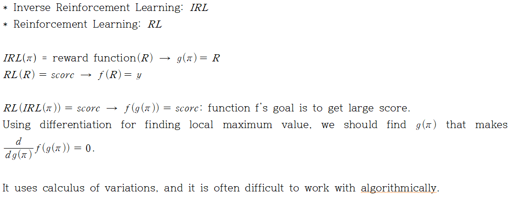 
    

___  

It uses linear approximation for the reward function, R is expressed as

 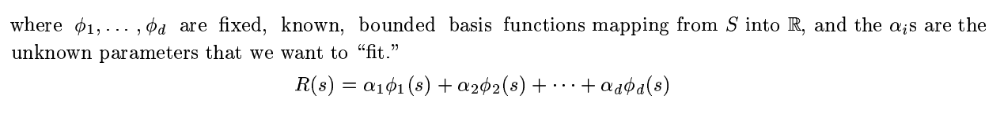 
 
**Φ is fixed, known, bounded basis function**   

Because of Value function V's form, it can be defined to linear as reward function is  

 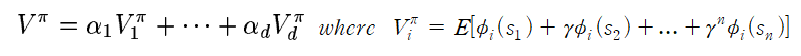 
 

For making π(s) = a_1 is optimal, it should be satisfy that condition:  

 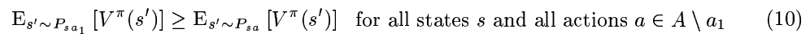 
 

But there are two problems.  
1) Because of inifinite states MDPs, there are infinitely many constraints of that form in upper condition. For checking upper condition at all states is impossible.   
<< For solving that problem, they uses sampling. Therefore, only check sampled states whether they satisfies condition.  

2) By defining R is linear function approximator, they may no longer be able to express any reward function for which π is optimal.   
<< For limiting various reward functions, they are willing to relax some of the constraints (10), paying a penalty when they are violated.   

Final linear programming formulation is then:  

 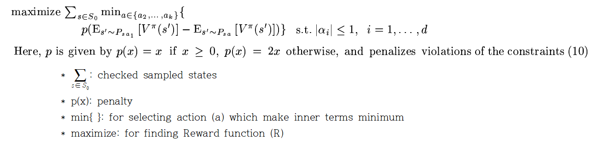 

## 5. IRL from Sampled Trajectories  
In this section, it uses actual trajectory datas, so it does not need explicit model of the MDP. By using reward function which they choose, they check thier model's ability to find optimal policy. Their goal is to find R such that π maximizes E[V]. To simplify, there is only one fixed start state s0(which can be a dummy state, whose next state distribution under any action is D. D is fixed initial state distribution.)  

First they will need a way of estimating V(s0) for any setting of the αs(α is the weight of R's basis function). Estimating V is necessary for comparing E[V]. To do this, 
1) Execute m Monte Carlo trajectories under π. They are actual expert trajectory data.   
2) For each i = 1, ..., d, define V_i(s0) to be what the average empirical return would have been on these m trajectories if the reward had been R = Φ_i. For example, 

 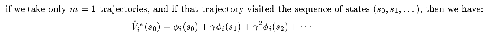 
  

Using that estimation, V_i(s0) is estimated by m trajectories expectation. And integrate i = 1, ..., d each expectation of value function for defining whole estimated form, using α it is estimated:  

 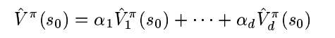 
   
(In this paper, it truncate traj data after a large but finite number H of steps. Because of discounting factor, truncation only introduce negliable samll error.)

**Algorithm** is that 
1) First find value estimates as described above for the policy π* which is given, and for the base policy π1 which is randomly chosen. (Compare π* and π1)
2) The inductive step of the algorithm is as follows: 
 They have some set of policies {π1, ..., πk}, and resulting reward function should satisfy below equation by selecting α.  
 
 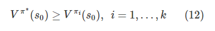 
  

3) Considering previous algorithm (section 4), they modify objective function slightly, so that the optimization becomes: 
 
  
   
 **NOTE: This equation use estimated value function**

4) That optimization uses estimated value function which is linear function, this problem is easily solved via linear programming. So we can get a new setting og the α. Hence we can get a new reward function.  
 
# Reference
* Algorithms for Inverse Reinforcement Learning: http://ai.stanford.edu/~ang/papers/icml00-irl.pdf 
* Linear programming: 
