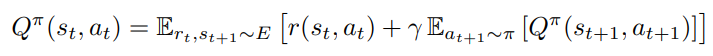
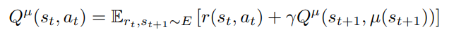
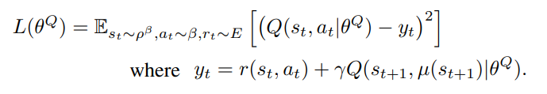
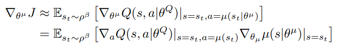
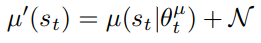
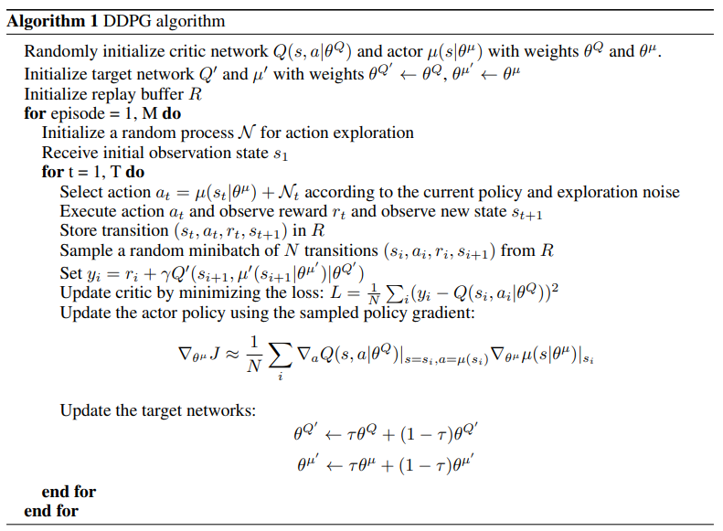

# Summary
In this paper, it uses deterministic policy gradient to implement actor-critic model free algorithm for continuous action space. Naive application of this actor-critic model is unstable. So it combines DQN and actor-critic approach. It uses DQN's idea, introduces neural network to DPG for implementing actor-critic approach about continuous action space.

___
### Background
**x_t**: observation, **a_t**: action, **r_t**: reward  
Environment is partially observed so, we need observation and action pair's history for expressing state as    
**s_t = {x_1, a_1, x_2, a_2, ..., a_t-1, x_t}**  

But, in this paper, assuming environment is fully observed. so **s_t** is equal to **x_t**.

Agent's action is expressed as policy, **π**: S -> P(A)  
initial state distribution **P(s_1)**, transition dynamics distribution is **P(s_t+1 | s_t, a_t)**, and reward function is **r(s_t, a_t)**.  
discounted future reward **R_t**, and actor's goal is to maximize expected discounted future reward '**J**'.

Using policy function **π**, visitation distribution for a policy **π** is expressed as **P_π(s)**.  
Action-value function is **Qπ(s_t, a_t)** = E[R_t | s_t, a_t]

**Bellman equation**: 

  

It describe the relation between at time 't' Q value and, at time 't+1' Q value.

If policy function is deterministic, 

  

Action is determined from state, so it only depends on environment. Behavior policy for exploration is used to Q training that is off-policy. It means Q function can learn various action on state. 

If we use neural network for approximating Q fuction, Q is parameterized theta. And the loss function is 

  

From this form, we know that for training model it uses temporal difference(TD).

___
### Algorithm
It is impossible to directly apply continuous action space to Q-learning. So we use DPG and actor critic approach.  
**Critic**: approximated Q-function.  
**Actor**: target policy function.  
Critic is trained by bellman function, Actor is trained by J, chanin rule. (J = expected future discounted reward). In other words, Actor is trained by deterministic policy gradient, we can check that form and proof on DPG, and it is defined as,

  

By DQN paper, for training Q network, it uses  
1) replay buffer: reduce dependecy between data.
2) Q net has a tendency to diverge, so make target network and use soft update for updating parameter of actor and critic's paramters.  
3) Use batch normalization for making same range, because low dimensional feature vector's each element's physical Units are different.

**NOTE**: There are not y_t which is true value of state and action pair's q-value. So it is impossible to train Q model by simply using loss function. In other words, y_t is expressed as **r_t(s_t, a_t) + gamma * garbage value** when train step, there is no limit on garbage value, so it makes Q-function prone to divergence. We need reference for training Q, so make pseudo reference as known as target network of Q. Its effects are  
1) limit divergence ( = put limits on garbage. )  
2) Same effect as supervised learning  

___
A major challenge of learning in continuous action spaces is exploration. An advantage of off policies algorithms such as DDPG is that we can treat the problem of exploration independently from the learning algorithm. It means off-policy collects data from behavior policy, so learning step's target policy is independent of collecting data. In that paper, it constructed an exploration policy(=behavior policy) µ0 by adding noise sampled from a noise process N to its actor policy, so it is defined 

  

N can be chosen to suit the environment.

The result's algorithm is 

  

# Results
# Reference
