# Summary
In this paper, 
1) Transforming stochastic policy to deterministic policy
2) For exploration, use off policy actor critic algorithm.

Because of using "Deterministic policy", it uses off policy for exploration.  
**off policy**: Use different policies for exploration and traning. On exploration step, it uses off policy, and on train step, it uses target policy.  

## Introduction
Standard policy function is defined as prbability distribution, but in this paper, policy function is defined as

 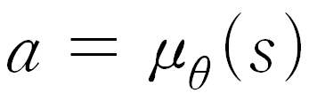 

By this form, it can be rewritten policy gradient form, and shows that its policy gradient form is the special case of stochastic policy function's policy gradient where policy variance is zero.

Comparing stochastic policy's policy gradient and deterministic policy's, in the case of deterministic policy we don't need to consider action space when estimating policy  gradient because its action is determined from state.

But it does not mean not using stochastic policy, but use it for off policy at exploration step. At traning step, target policy is deterministic policy.

In this paper, by using D.P.G it brings out actor-critic-algorithm form. Approximating action-value function and updating policy parameter from approximated action-value-gradient direction. And using compatible function approximating's concept, showing approximation does not cause P.G's bias.

## Background
Agent's goal is to maximize rewards gotten by taking action. The defined expected rewards from actor and critic approximated function is

 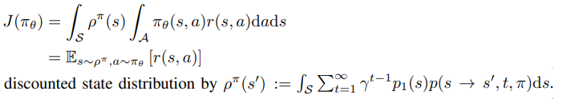 

r(s,a) is replaced to appriximated Q function.  
___
So, **stochastic policy gradient(SPG)** from expected reward by stochastic policy function is defined as

 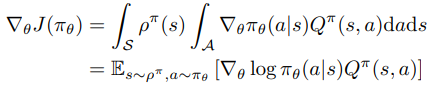 

We can get this result from Sutton PG paper. This form shows that S.P.G is not realted with discounted state distribution's gradient. One issue that these algorithms must address is how to estimate the action-value function Qπ(s, a). Perhaps the simplest approach is to use a sample return(rewards) to estimate the value of Qπ(s_t, a_t), which leads to a variant of the REINFORCE algorithm.   

___
In **Stochastic actor-critic algorithm**, actor is updated by SPG. Instead of using Qπ(s_t, a_t), Critic approximate Qπ(s_t, a_t) to Qw(s_t, a_t) by using Temporal difference or Monte carlo simulation. But for no bias Sutton's PG, critic's parameters should satisfy 2 conditions.

 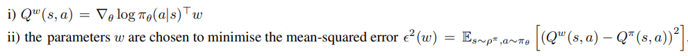 
  
It is also proven by Sutton.  

If 1), 2) conditions are satisfied, Qπ - Qw = e is zero, so bias is zero. If "1)" is satisfied, compatible function approximator is linear to log policy probability's gradient. "2)" means solving regression model approximaing Qπ. We can do 2) by using Temporal difference(TD) to estimate value function.

____
**Off policy Actor-Critic** means behavior policy is not equal to target policy. if we define behavior policy 'beta(a|s)', SPG is defined as

 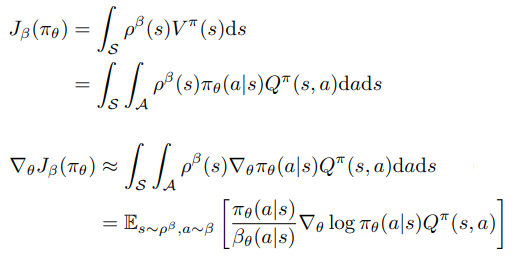 

* It does not depend on Q-function's gradient. It means at Actor updating Critic does not affect actor for actor's convergence to local optima. In other words, there is local optima at approximated policy function about fixed approximated Q function.   
    
* Both Actor and Critic are trained by using off policy methods.   

* For calculating off policy's policy gradient, not use Qπ, but TD errror which is defined as   

 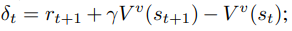 

## Gradients of Deterministic Policies
**Action-Value Gradients**: 

 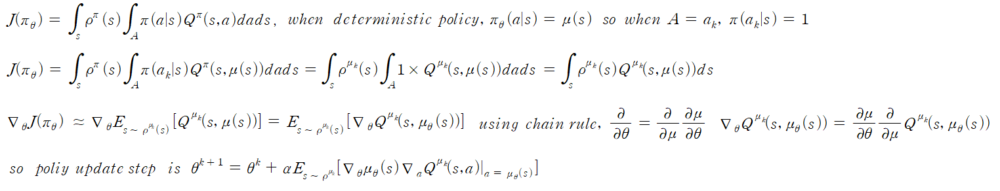 

Don't need to calculate discounted stationary state distribution's gradient, but calculate Q-function's gradient.

____
**Deterministic policy gradient Theorem**:
"performance objective" is evaluation function of policy, and it is defined 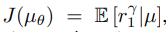 and it is rewritten as

 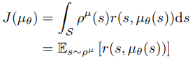 

and its gradient is

 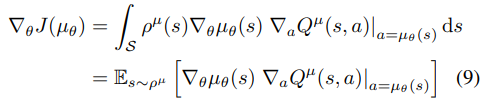 

____
**Limit of the stochastic Policy gradient**: Deterministic policy is the special case of stochastic policy. For example, if policy function's shape is Gaussian distribution, when its variance is zero, its probability is 1 at X = mean. So it can be written as

 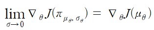 

## Deterministic Actor-Critic Algorithm
**on-policy Deterministic Actor-Critic**: If it uses deterministic policy function, it does not gurantee exploration. So it should uses noise for exploration. 
Update order is 

 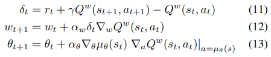 

11) is TD, 12) is critic update, 13) is actor update.   

____
**off-policy Deterministic Actor-Critic**: off policy deterministic gradient is defined as

 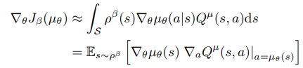 

In that form, beta is the behavior policy function, and mu is the target policy functoin. Sampling from behavior function is enough to estimate policy gradient.  

Using state,action pair data from behavior policy function for training, upadate order is, 

 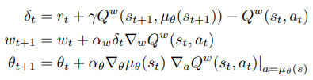 

**Note**: As i prove that deterministic policy gradient, integral over action is removed so we don't need to importance sampling on actor. It is the reason in that form, it only uses behavior policy function's discounted stationary probability, not included behavior policy function.  

____
**Compatible function approximation**: In this chapter, it show that critic's gradient can be replaced.  without affecting deterministic policy gradient. In Sutton PG, also Q_pi is replaced bt Q_w.  

In Sutton PG's paper, for replacing Q_pi to Q_w, it should satisfy . (f is the approximated Q function). And w is determined, Mean square loss of Q_pi and Q_w(=f) is minimum. So it can written as

 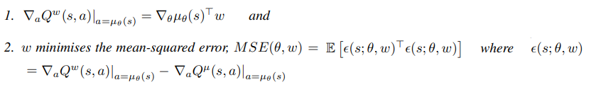 
  

By this condition Q_pi is replaced by Q_w and deterministic policy gradient can be defined by using Q_w. Proof is that,

 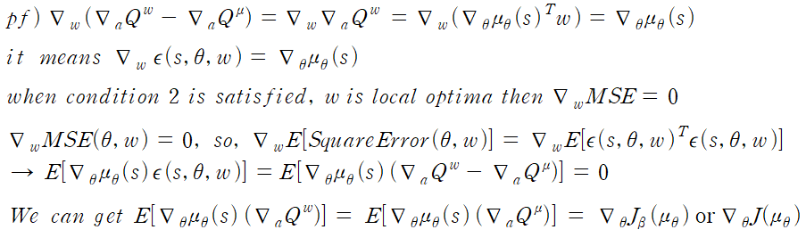 
  

For any deterministic policy µθ(s), there always exists a compatible function approximator of the form 

 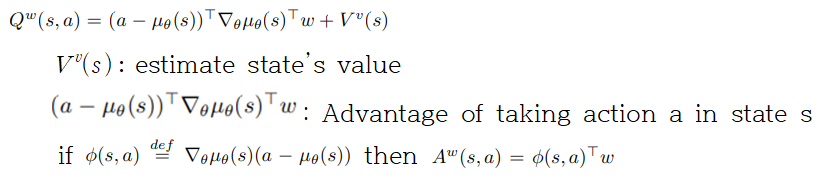 
 
It satisfies 1) condition. From that form, we know if action is large, Advantage is large so Q is large. But action is determined from deterministic policy, and deterministic policy determine action with small deviation, Advantage value is defined as

 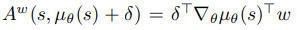 
 
It means a linear function approximator is sufficient to select the direction in which the actor should adjust its policy parameters.

**NOTE**: To satisfy condition 2, we should have to find the parameters w that minimizes MSE. But it is difficult acquiring unbiased samples of the true gradient, so we use policy evaluation method but it does not satisfy 2) condition.
____
**COPDAC-Q algorithm**
(s,a) pair data is sampled from behavior policy, 

 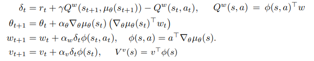 
 

# Results

# Reference
Importance sampling: https://untitledtblog.tistory.com/135
