# Summary  
  Policy gradient methods requires large number of samples, and it is the main cause of bias and high variance. In this paper, it suggests policy gradient estimator which reduces variance while it maintains acceptable bias. And we call this estimation schema as GAE. This paper's contributions are 1) justification and intuition about effective variance-reduction scheme. 2) Using trust region optimization method to value function.  
 
 
 ## Preliminaries  
 Terms and standart policy gradient estimate method is given on previous papers. In sutton PG's for getting non biased approximated q function, it should satisfy compatible condition. But in this paper, it does not assume compatible condition, and discuss how to obtain biased(but not too biased) estimator of Advantage function.   

 **It introduces a parameter γ that allows it to reduce variance by downweighting rewards corresponding to delayed effects, at the cost of introducing bias**. They treat it as a variance reduction parameter in an undiscounted problem; this technique was analyzed theoretically by Marbach & Tsitsiklis (2003); Kakade (2001b); Thomas (2014). **In theory discounted advantage function is no bias, because Value function is average of Q function with respect to action**  
 
 It uses disctouned advantage, value, q functions and use it for defining discounted approximation to the policy gradient. For obtaining biased(but not too biased) estimator of Advantage function, they introduce the notion of a γ-just estimator of the advantage function, which is an estimator that does not introduce bias when we use it in place of Aπ,γ (which is not known and must be estimated) in Equation if policy gradient to estimate g^γ. **(No bias means E[Y - predicted(Y)] = 0)**  
 
 The definition is as follows  
 
  
   
 We know that advantage function is Q(s,a) - V(s). So In definition, Q(s,a) - b(s) form is equal to Q(s,a) - V(s) form. And it satisfy no bias form.  
 
  
 
 
 And one of the shape for approximated advantage function being γ-just is  
  
  
  
 
 Proposition 1's meaning is that, 
  
  
   
  It shows that, not discounted Q-function can be equal to discounted Q function, as advantage estimator is γ-just.  
 
 **So when Approximated advantage function is γ-just, by using definition 1, proposition 1 and "discounted advantage function is no bias", policy gradient estimator is no bias.**   

 
 ## Advantage function estimation  
 **If value function is correct, TD residual is no bias.** It means approximated advantage function by TD residual is no bias. But this is correct when V is γ-just.(=correct value function). 
 
  
  
 
 Using no bias step 1 TD residual(=1 step advantage when Value function is correct), let's define no bias k steps' advantage.
 
 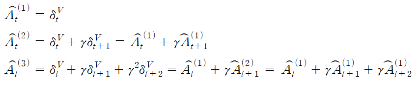 
  
 
  
  
 
 Because it uses correct discounted reward and correct value function, it is no bias advantage function form. It means it defines unbiased advantage function form when k is infinite.  
  
 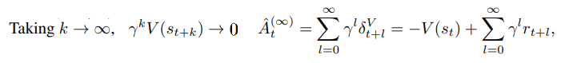 
 
 
 By using infinite step form, we can derive generalized exponentially weighted form by lambda, 
 
 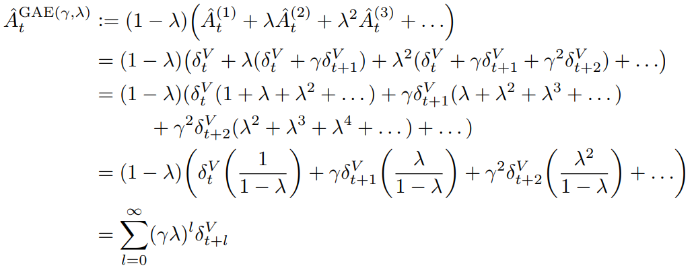 
   
 In that form, GAE() means "discounted factor". Its special cases are 1) lambda = 0, 2) lambda = 1,
 
 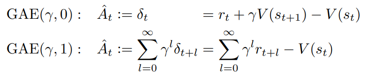 
    
  
  First form, lambda = 0, advantage function's **bias** depends on the accuracy of value funtion. But it has **lower variance** by assembled rewards than lambda = 1. Second form, lambda = 1, advantage function's bias does not depend on the accuracy of value funtion, but reward. It has **high variance** due to the sum of terms. In other words, lambda = 0 makes low variance but biased, lambda = 1 makes high variance but no biased. **The generalized advantage estimator for 0 < λ < 1 makes a compromise between
bias and variance, controlled by parameter λ.**    
**NOTE: reward function is known and, has a range. So it has high variance but no bias.**   

 Using that generalized advantage estimator, we can redefine policy gradient estimator g, as follows. 
 
 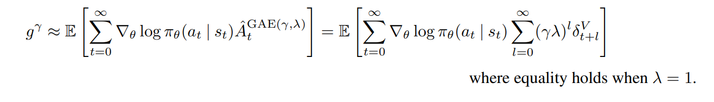 
   

  
  ## Interpretation as reward shaping  
  
  
  ## Value function estimation   
  In this paper, for the experiments, it used a trust region methods to optimize the value function. It helps avoiding overfitting to the most recent batch of data. To formulate the trust region problem, it defines variance as
  
 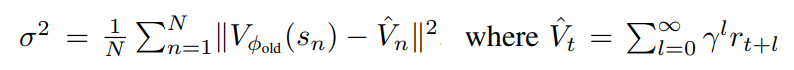 
   

 And use it as constraint( = trust region)
  
 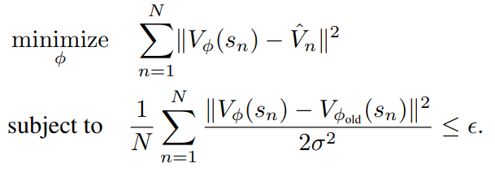 
   
  
  **Because, This constraint is equivalent to constraining the average KL divergence between the previous value function and the new value function to be smaller than ε, where the value function is taken to parameterize a conditional Gaussian distribution with mean Vφ(s) and variance σ^2.**  
  
 1. Vφ(s) is mean in Gaussian distribution, by minimizing MSELoss between Vφ(s) and γ-just approximated value function, Vφ(s) is closer to γ-just approximated value function. Therefore Vφ(s) becomes no biased.  
 2. We can see that Constraint form is similar to normal distribution's exponential's Indices. It means updated value function is guranteed in the specific range. For helping your understanding, this figure well illustrates its meaning.  
  
 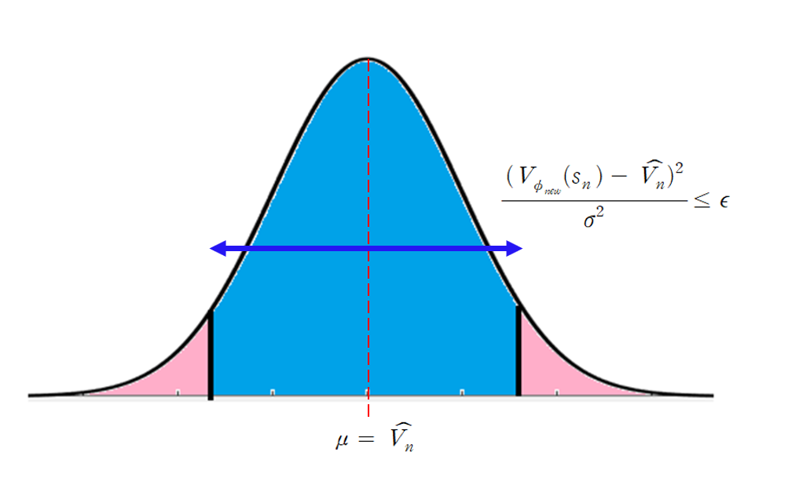 
   
  
 **Constraint term makes Value function update to γ-just approximated value function by limiting range.**
  
  We compute an approximate solution to the trust region problem using the conjugate gradient algorithm (Wright & Nocedal, 1999). Specifically, we are solving the quadratic program.  
   
 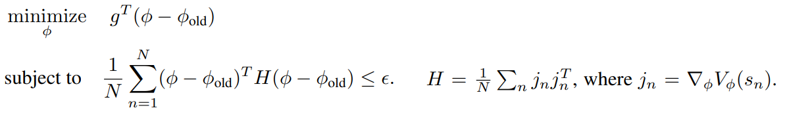 
   
   
  Trust region problem is approximated by that principle, (29) -> (30) by linear approximation and using approximated KL-divergence. Conjugate gradient algorithm is used because, Lagrange multiplier method's result equation's form is equal to Ax = b.
  
 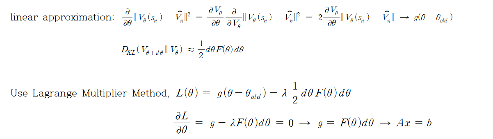 
    
  
 
 ## Experiments  
  It designed a set of experiments to investigate the following questions:  
1. What is the **empirical effect of varying λ ∈ [0, 1] and γ ∈ [0, 1]** when optimizing episodic total reward using generalized advantage estimation?  
2. Can generalized advantage estimation, along with trust region algorithms for policy and value function optimization, be **used to optimize large neural network policies** for challenging control problems?  

 ### Policy Optimization algorithm  
 Algorithm is similar to prior work(TRPO). Fixed algorithm, but varying the γ, λ for checking its effect. The difference with TRPO is value function's update's rule. It uses approximate trust region for updating value function.   
  
 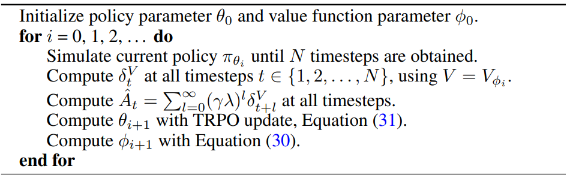 
  
 **NOTE: policy update by using old value function, not updated value funtion.**  
 
 ### Architecture  
 We used the same neural network architecture for all of the 3D robot tasks, which was a feedforward network with three hidden layers, with 100, 50 and 25 tanh units respectively. The same architecture was used for the policy and value function. The final output layer had linear activation. The value function estimator used the same architecture, but with only one scalar output. For the simpler cartpole task, we used a linear policy, and a neural network with one 20-unit hidden layer as the value
function. 
 **I will implement Cartpole_GAE with neural network architecture for 3D robot tasks.** 
 
 ### Cartpole  
 The best results are obtained at intermediate values of the parameters: γ ∈ [0.96, 0.99] and λ ∈ [0.92, 0.99]. At γ = .99, the fastest policy improvement is obtain by intermediate values of λ in the range [0.92, 0.98].  
   
# Result  

# Reference  
HIGH-DIMENSIONAL CONTINUOUS CONTROL USING GENERALIZED ADVANTAGE ESTIMATION: https://arxiv.org/pdf/1506.02438.pdf  
