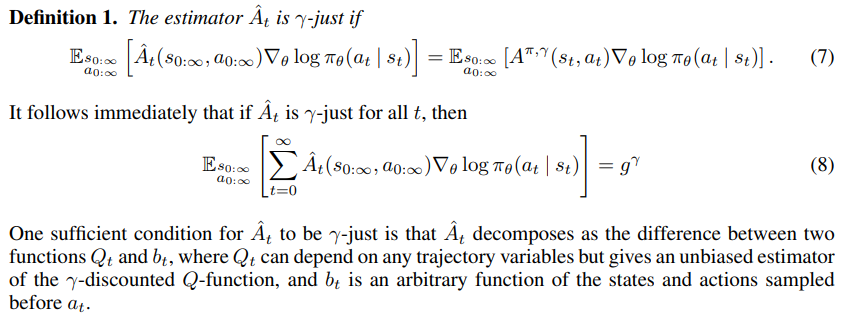
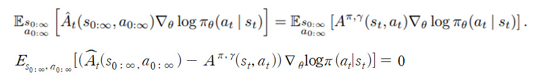
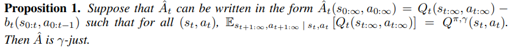
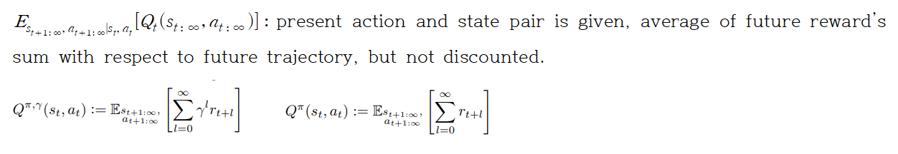
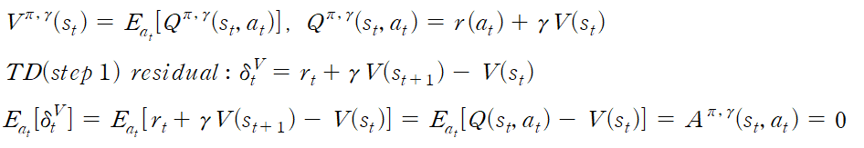
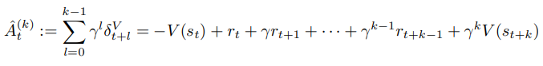

# Summary  
  Policy gradient methods requires large number of samples, and it is the main cause of bias and high variance. In this paper, it suggests policy gradient estimator which reduces variance while it maintains acceptable bias. And we call this estimation schema as GAE. This paper's contributions are 1) justification and intuition about effective variance-reduction scheme. 2) Using trust region optimization method to value function.  
 
 ## Preliminaries  
 Terms and standart policy gradient estimate method is given on previous papers. In sutton PG's for getting non biased approximated q function, it should satisfy compatible condition. But in this paper, it does not assume compatible condition, and discuss how to obtain biased(but not too biased) estimator of Advantage function.   

 **It introduces a parameter γ that allows it to reduce variance by downweighting rewards corresponding to delayed effects, at the cost of introducing bias**. They treat it as a variance reduction parameter in an undiscounted problem; this technique was analyzed theoretically by Marbach & Tsitsiklis (2003); Kakade (2001b); Thomas (2014). **In theory discounted advantage function is no bias, because Value function is average of Q function with respect to action**  
 
 It uses disctouned advantage, value, q functions and use it for defining discounted approximation to the policy gradient. For obtaining biased(but not too biased) estimator of Advantage function, they introduce the notion of a γ-just estimator of the advantage function, which is an estimator that does not introduce bias when we use it in place of Aπ,γ (which is not known and must be estimated) in Equation if policy gradient to estimate g^γ. **(No bias means E[Y - predicted(Y)] = 0)**  
 
 The definition is as follows  
 
  
   
 We know that advantage function is Q(s,a) - V(s). So In definition, Q(s,a) - b(s) form is equal to Q(s,a) - V(s) form. And it satisfy no bias form.  
 
  
 
 
 And one of the shape for approximated advantage function being γ-just is  
  
  
  
 
 Proposition 1's meaning is that, 
  
  
   
  It shows that, not discounted Q-function can be equal to discounted Q function, as advantage estimator is γ-just.  
 
 **So when Approximated advantage function is γ-just, by using definition 1, proposition 1 and "discounted advantage function is no bias", policy gradient estimator is no bias.**   
 
 ## Advantage function estimation  
 **If value function is correct, TD residual is no bias.** It means approximated advantage function by TD residual is no bias. But this is correct when V is γ-just.(=correct value function). 
 
  
  
 
 Using no bias step 1 TD residual(=1 step advantage when Value function is correct), let's define no bias k steps' advantage.
 
  
  
 
 
 
   
   
# Result  

# Reference  
HIGH-DIMENSIONAL CONTINUOUS CONTROL USING GENERALIZED ADVANTAGE ESTIMATION: https://arxiv.org/pdf/1506.02438.pdf  
