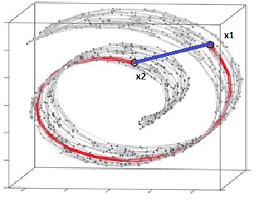
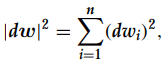
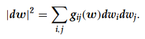
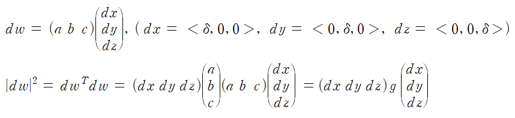
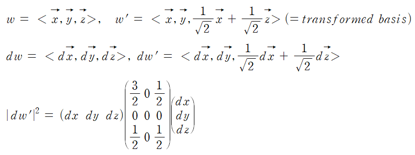
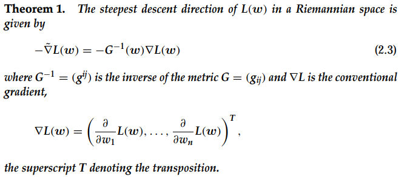
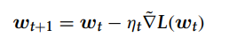
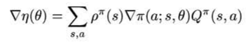
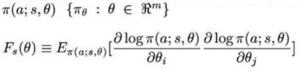

I read two papers 1) A Natural policy gradient, 2) Natural Gradient Works Efficiently in Learning. "Natural Gradient Works Efficiently in Learning" paper explains why use natural gradient and how to calculate it, and "A Natural policy gradient" paper apply natural gradient to policy gradient method.  

# Natural Gradient Works Efficiently in Learning
When a parameter space has a certain underlying structure, the ordinary gradient of a function does not represent its steepest direction, but the natural gradient does. Natural gradient is that it considers parameter space's base vector for steepest direction. For example, let's consider that manifold 

  

In that data manifold, 'x1' and 'x2' are judged "close", when its distance is calculated by Euclidean space's metric function. But considering data structure, its distance should be calculated by using "red line". So we should consider data structure and, re-define its metric function.  

___  
### Natural gradient
Let S = {w ∈ Rn} be a parameter space on which a function L(w)is defined.  
1) If S is a Euclidean space with an orthonormal coordinate system w, the distance between 'w' and 'w + dw' is

  
  

2) However, when the coordinate system is nonorthonormal, the squared length is given by the quadratic form 

  
 
For example, 

  
  

if S is curved manifold, there is no orthonormal linear coordinate. G = g_ij(w) is called Riemmanian metric tensor. 

  
  

___  
### Steepest descent direction of a funciton L(w) at w
It is defined d by the vector dw that minimizes L(w + dw) where |dw| has a fixed length, that is, under the constraint |dw|^2 = ε^2 for a sufficiently small constant ε.

**Theorem 1**: the gradient of Riemannian space is given that,

  
  

**pf)**   

  
  

___
### Natural gradient learning  
Let's assume that 'z' is sampled from Q(z). And input this 'z' to neural network paramterized 'w'. I(z,w) is loss function. We can define  
**L(w) = E[I(z,w)]** : risk function, average loss.  Neural network goal is to minimize L(w).  

The optimal parameter w* optimizes L(w). We can get optimal w* by using natural gradient and update rule.   

   
  

# A Natural policy gradient
A Natural Policy gradient paper suggests "covariant gradient" by defining a metric based on the underlying structure of the policy. They apply natural gradient to policy gradient method and it makes model update toward choosing a greedy optimal action.  

### Natural Gradient  
In Policy gradient method, Policy gradient(PG) is calculated 

   
   

The steepest descent direction is defined as the vector d_theta that minimizes expected future discounted rewards under the constraint that the squared length |d_theta|^2 is held to a small constant. We can check its proof on "Natural Gradient Works Efficiently in Learning". Anyway, pi is probabilistic manifold, and its fisher information matrix is defined as  

   
   

Fisher information matrix is positive definite. But why we use fisher information matrix? Because

   
   

# Results

# Reference
* A Natural policy gradient paper: https://repository.upenn.edu/cgi/viewcontent.cgi?article=1128&context=statistics_papers  
* Natural Gradient Works Efficiently in Learning paper: https://citeseerx.ist.psu.edu/viewdoc/download?doi=10.1.1.452.7280&rep=rep1&type=pdf  
* image from https://parkgeonyeong.github.io/Manifold-Learning-%EC%95%8C%EA%B3%A0%EB%A6%AC%EC%A6%98-(SNE,-/.)/
* 
