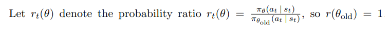
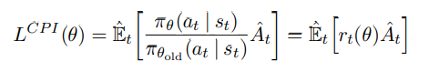
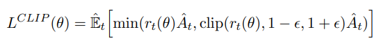
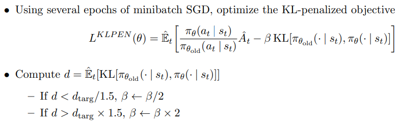
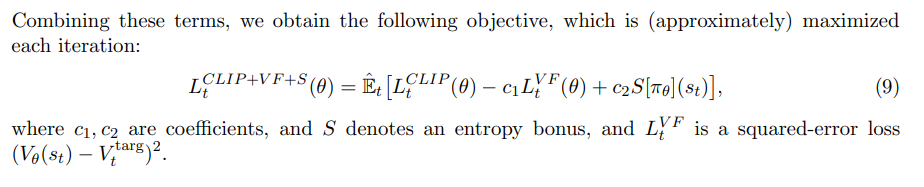
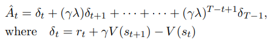
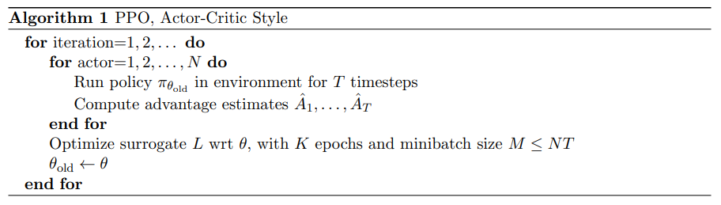
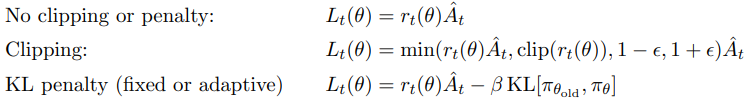

# Summary  
Standard policy gradient methods perform one gradient update per data sample, we propose a novel objective function that enables multiple epochs of minibatch updates. **The new methods, which we call proximal policy optimization (PPO), have some of the benefits of trust region policy optimization (TRPO), but they are much simpler to implement, more general, and have better sample complexity (empirically).**   

## Introduction
Although many reinforcement learning methods are considered so far, still there is room for improvement in developing a method that is scalable (to large models and parallel implementations), data efficient, and robust (i.e., successful on a variety of problems without hyperparameter tuning). Q-learning (with function approximation) fails on
many simple problems and is poorly understood, vanilla policy gradient methods have poor data effiency and robustness; and **trust region policy optimization (TRPO) is relatively complicated, and is not compatible with architectures that include noise (such as dropout) or parameter sharing (between the policy and value function, or with auxiliary tasks). This paper seeks to improve the current state of affairs by introducing an algorithm that attains the data efficiency and reliable performance of TRPO, while using only first-order optimization.**   

1. We propose a novel objective with clipped probability ratios, which forms a pessimistic estimate (i.e., lower bound) of the performance of the policy  
2.  To optimize policies, we alternate between sampling data from the policy and performing several epochs of optimization on the sampled data   

## Background  
1. **Policy gradient Methods:**  
2. **Trust region methods:**  
  In TRPO, objective function is approximated linear, and constraint is approximated quadratic form. So we can use conjugate gradient algorithm for calculating step update direction. And by using Largrange Multiplier Methods, constraint term becomes penalty terms, in objective function. It becomes easier to solve. **But, it is difficult to determine step size.(It does not use fixed penalty coefficient 'beta'). Beta is determined by line searching on constraint, so it is impossible to use it fix.** For achieving our goal of a first-order algorithm that emulates the monotonic improvement of TRPO, experiments show that it is not sufficient to simply choose a fixed penalty coefficient β and optimize the penalized objective Equation (5) with SGD; additional modifications are required.

## Clipped Surrogate Objective  
Let's set a notation. 

  
   

TRPO's surrogate objective function is as follows and, its goal is to maximize it.  

  
   

Without a constraint, maximization of L_CPI would lead to an excessively large policy update; hence, we now consider how to modify the objective, to penalize changes to the policy that move r_t(θ) away from 1. Because updated policy gives high probabiltiy on specific state that old policy's probability is too small, trpo's surrogate objective function's value diverges to infinite regardless of advantage function.  

The main objective we propose is the following:  

  
   

___  
**Q. Why is this form suggested?**  
If r_t(θ) is out of range [1-ε, 1+ε], it removes incentive. Finally, (7) is L_CPI's lower bounds. If θ is equal to θ_old, L_CLIP = L_CPI. But θ becomes far away from θ_old, L_CLIP becomes far away from L_CPI. **Original TRPO's surrogate function's "constraint role(=function)" is equal to clipped objective fuction's "clip".** So we does not need to use quadratic form of constraint in L_CLIP!  
___   

Figure 1 shows how L_CLIP is drawn. **Figure 2 shows L_CLIP is less than L_CPI.(=lower bound of L_CPI is L_CLIP)** It means that it gives penalty on large policy step!) This prevents L_CPI from getting too big.  

## Adaptive KL Penalty Coefficient  
**NOTE: It is different with L_CLIP. It is another method that use KL diverge.** Another approach, which can be used as an alternative to the clipped surrogate objective, or in addition to it, is to use a penalty on KL divergence, and to adapt the penalty coefficient so that we achieve some target value of the KL divergence d_targ each policy update. In our experiments, we found that 1) the KL penalty performed worse than 2) the clipped surrogate objective, however, we’ve included it here because it’s an important baseline.  

  
   
"d" means distance between old policy and updated policy. The Large d means that it is updated large step.   

**d < d_targ / 1.5 (=small d =step is small =we should extend update size. So reduce penalty)** d_targ is hyperparameter and initial beta(penalty coefficient) is hyperparameter too. initial beta and d_targ is given.    

## Algorithm  
It uses GAE or the finite-horizon estimators for getting variance-reduced advantage-function estimators. And if using a neural network architecture that shares parameters
between the policy and value function, it should do additional work. So I do not implement deep neural nets which parameters are not shared. But if you want net to share parameters, you should use a loss function that combines the policy surrogate and a value function error term, because of training shared parameters. Therefore loss function is that,  

  
   
Entropy has a maximum value when p(x)'s probability distribution is uniform. So it ensures sufficient exploration. As training becomes stable, L_CLIP's advantage is bigger than Entropy bonus, so policy becomes far away from uniform distribution.  
 we can get advantage estimator which is well suited for our work(controll its bias and variance) by GAE. Generalizing this choice, we can use a truncated version of generalized advantage estimation, which reduces to Equation (10) when λ = 1:  

  
   

A proximal policy optimization (PPO) algorithm that uses fixed-length trajectory segments is shown below. Each iteration, each of N (parallel) actors collect T timesteps of data. Then we construct the surrogate loss on these NT timesteps of data, and optimize it with minibatch SGD (or usually for better performance, Adam [KB14]), for K epochs. **(Its method is appeared in DQN in the first time for reducing Dependency between data.)** 

  
   

## Experiments  

  

It shows Clipped TRPO (PPO(clip)) is best when hyperparameter ε = 0.2. Adaptive KL d_targ = 0.01 is best when β was initialized at 1 and compared in themselves. And PPO shows best score when comapre with other methods such as A2C, TRPO and so on.  

# Results  
## Architecture:  
 To represent the policy, we used a fully-connected MLP with two hidden layers of 64 units, and tanh nonlinearities, outputting the mean of a Gaussian distribution, with variable standard deviations, following [Sch+15b; Dua+16]. We don’t share parameters between the policy and value function (so coefficient c1 is irrelevant), and we don’t use an entropy bonus.
 
## Objective function: 
 I use two objective function which are 1) **L_CLIP**, 2) **L_KLPEN** for training Pendulum-v1   
 
## Hyperparameter: 
 1) **ε = 0.05 for L_CLIP**  
    ε = 0.2 is too large for Pendulum-v1 policy update. So i use ε = 0.05. Advantage normalization is not needed becasue in this code, i do not use conjugate gradient algorithm (I think Advantage normalization is needed for conjugate gradient algorithm's convergence's speed)   
    
 2) **Adaptive KL d_targ = 0.01, β was initialized at 1 for L_KPLEN**  
    asd  
    
    
### L_CLIP  
     
    
   
### L_KLPEN  

# Reference  
Proximal Policy Optimization Algorithms: https://arxiv.org/pdf/1707.06347.pdf
