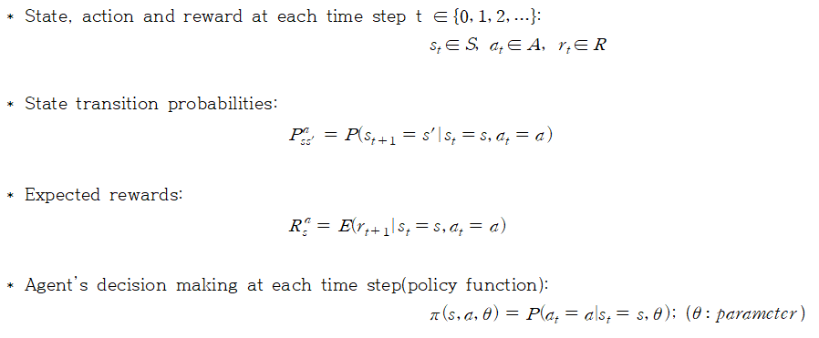
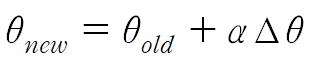
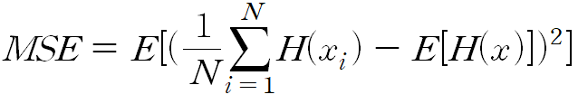
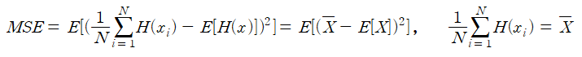
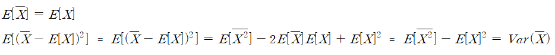
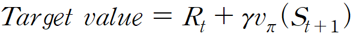
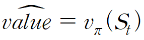
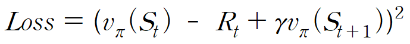
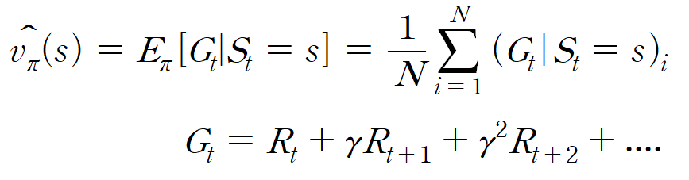

# What is Policy gradient method?
## Terms

## Purpose
Finding optimal policy funtion's parameter theta by using policy gradient.

Update rule is that

  

Using optimal policy function, and finding optimal trajectory is the ultimate goal of policy gradient method.  
**NOTE: But it is difficult to calculate policy gradient so, we should estimate it. But "Sutton PG" suggests how to estimate it**

# Monte carlo policy gradient
It uses trajectories data for estimating policy gradient. Trajectories data is obtained from policy function by simulation. But each trajectories has different length and, if some trajectories are long, it takes a long time to learn. And use various trajectories makes estimated policy gradient have high variace. 

**NOTE** : In monte carlo simulation, variance means error. For example, let's consider situation where we got sampled trajectories data from policy function. We can estimate 
E[H(X)] by using monte carlo simulation.

  

If we define error by using mean square error,

  

Estimated result from sampled trajectories data is equal to sample mean, we can rewrite that form like 

  

and, sample mean's mean is unbiased estimate of expected value, so  

  

We can conclude that monte carlo simulation's result's variance is equal to MSE.

# Actor-critic policy gradient
It is a kind of Policy gradient method. It uses two weight parameter for representing actor and critic. Critic's concept is to complement for not known action-value function.

**Actor**: At actor step, it uses critic step's result's approximated Q-function for evaluating policy, and use that result for updating policy. For updating policy, it use policy gradient for deciding which direction to update.  

**Critic**: At critic step, it uses actor step's result's policy function for approximating Q-function(action-value function) which makes present policy function optimal.    

# Sampling method
## Temporal difference
It is the method for traning model. **As the episode progresses, train the model by using every step's state and action pair, where action is chosen from policy function**.  
If model is defined V_theta(s_t, a_t), and it means when it is on state 's' and choose action 'a' at time 't', its value is calculated from model V_theta. If agent take action 'a' on state 's' and next state is s_next, model return reward R. The target value is defined as

  

And model predicts value from state 's' and it is defined as

  

Model trained from loss, and loss is defined as

  

## Monte carlo simulation
It is the same as Temporal difference in that it trains the model, but Monte carlo simulation use trajectories data, not step data.  
In episodes, we can get rewards data. After finishing episodes, by using rewards data and discount function, update state's value function. The states visited in the episode are updated in reverse chronological order.

For example, model should be output target value which is defined as

  

We can get various S, G pair by doing episodes many times. And use them for training

# Paper
1. Sutton PG: https://proceedings.neurips.cc/paper/1999/file/464d828b85b0bed98e80ade0a5c43b0f-Paper.pdf  
  It suggests how to calculate and estimate policy gradient. It is the basic of policy gradient method. 
  
2. Actor critic: https://proceedings.neurips.cc/paper/1999/file/6449f44a102fde848669bdd9eb6b76fa-Paper.pdf  
  It suggests combination of actor only method and critic only method for improving each methods' problem. Actor can be considered as approximated policy function and Critic can be considered as approximated value function of state. Actor is updated from evaluation of Actor by using Critic, and Critic is updated from reward or cost from action chosen from Actor. One whole system's update includes actor, critic's update.   
  
3. DPG: http://proceedings.mlr.press/v32/silver14.pdf  
  It suggests deterministic policy function's policy gradient and use it for dealing with continuous action space. For exploration which is not done by deterministic policy, it uses off policy. And proove that determinisitic is the special case of stochastic when variance is zero.

4. DDPG: https://arxiv.org/pdf/1509.02971.pdf  
  It combines DQN and actor critic agorithm for treating continuous action space. It implements DPG paper's results by using deep neural network.

8. NPG
9. TRPO
10. GAE
11. PPO

# Reference  
https://dnddnjs.gitbooks.io/rl/content/actor-critic_policy_gradient.html  
https://dnddnjs.gitbooks.io/rl/content/mc_prediction.html  
https://dnddnjs.gitbooks.io/rl/content/td_prediction.html  
https://m.blog.naver.com/yunjh7024/220863118407  
