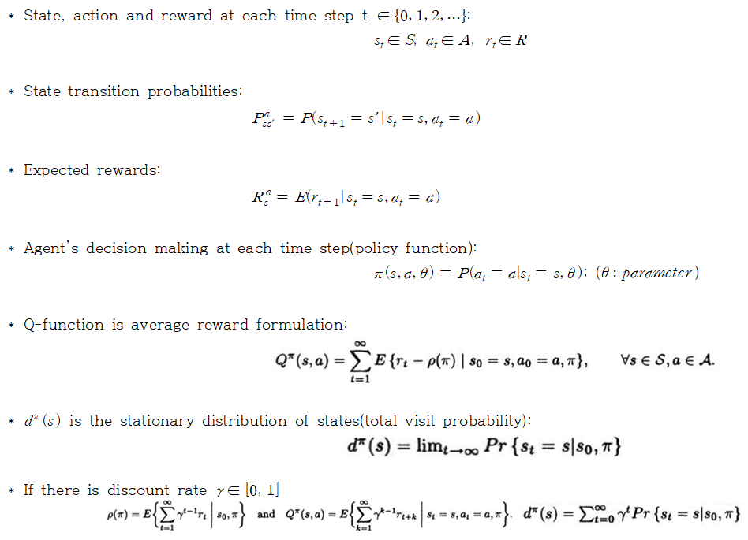

# Summary:
Using policy gradient, update policy function's parameter theta. Policy function is defined as:

  

Policy gradient and Update rule is:

  

In this paper suggest how to get policy gradient. Policy gradient caculated by

  

So we need to define the function that evaluate poliy. And it is defined as

  

Each term means

  

# T
