# Summary:
Make evaluating policy function and use its gradient for update policy. Assume poliy function is parameterized by theta, using policy gradient, update poliy function for finding 
optimal policy function.

* Each term means

  

* Using policy gradient, update policy function's parameter theta. Policy function is defined as:

 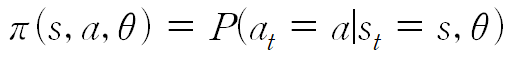 
 

* Policy gradient and Update rule is:

 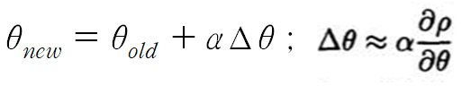 

* In this paper suggest how to get policy gradient. Policy gradient caculated by

 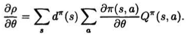 

* So we need to define the function that evaluate poliy. And it is defined as

  

## Theorem 1.

 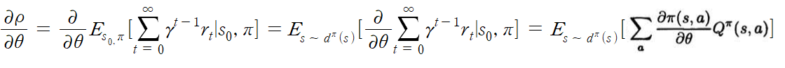 

  
**NOTE**: the key aspect of both expressions for the gradient is that their are no terms of the form **d^pi(s)'s derivative with respect theta** : the effect of policy changes on the distribution of states does not appear.   
**NOTE**: Also Q is defined by poliy, but its derivative with respect theta does not appear at the policy gradient. 

Q is not noramally known and must be estimated. it can be estimated by

 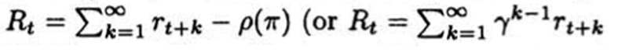 

It means we can estimate Q by sampling.

## Theorem 2.
In this chapter, we can replace Q function to approximate function f with some condition. To get exact Q is difficult, so we use approximate function for getting gradient.

Q function is approximated 'f' which is parameterized 'w'.  In this case, Q is replaced by f. 'w' is trained by loss defined as (Q_pi - f_w)^2, w's gradient is 

  

So, expected loss function on specific policy is defined as 

 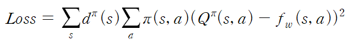 

But we don't know exactly Q, so we should use "approximated Q", not Q. Therefore w's gradient is rewritten, 

 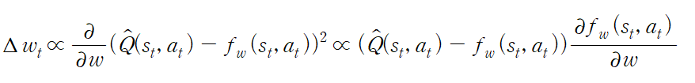 

If it is convergence to optimum, w's gradient is zero. 

 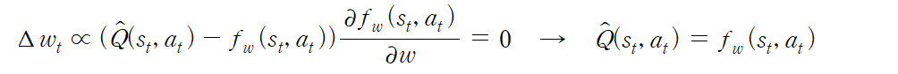 

And approximated Q is unbiaed estimator of Q, expected value of approximated Q is equal to expected value of Q.

 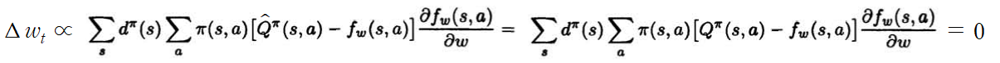 

And if 

 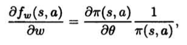 

this condition is satisfy, we can get theorem 2's result: 

 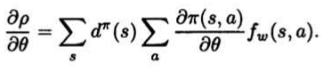 

**NOTE**: if "f derivative with respect of w" is zero, policy is on local or global optimal. So this case is not considered

## Application to Deriving Algorithms and Advantages
Consider that policy function

  

For defining Theorem 2, f_w should satisfy condition. So we can get,

 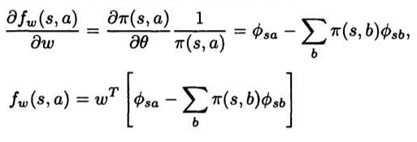 

If we use nonlinear f_w function, we can derive variety. Anyway above f's form is similar to "Q - V" formula

 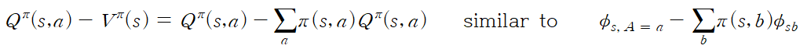 

Therefore, recall advantage function's property, we can get f_w's mean is zero.

 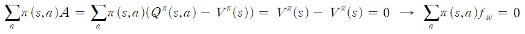 

## Convergence of Policy iteration with function approximation
In this chapter prove that As we use approximated function f, policy is convergent to specific policy.

## Using Monte Carlo simulation for estimating gradient
We can estimate gradient by using Monte Carlo simulation. 

 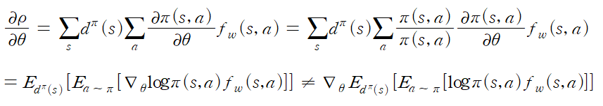 

From N times trajectories, we can estimate stationary state probabilties and policy probabilties.

## Algorithm 
1. Calculate w. For sure, satisfy that condition.

 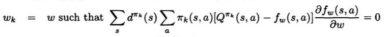 

2. Use w for calculating policy gradient.

  

3. update policy

 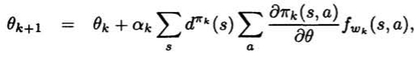 

Repeat 1~3, when policy is convergent to some policy
