# Summary
## 1. Approximately Optimal Approximate Reinforement Learning:  
It presents lower bound of the difference in reward between policy functions. This form is used in TRPO paper.   

That form is given by quantifying policy improvement.  

  
  

The new policy is defined as  

  
   

By that form, when α = 0, new policy is equal to π and, when α = 1 new policy is equal to π'. And the poliy gradient of new policy when α = 0 is given by  

  
  
By same insight, 

  
  

___
**Lemma 2:** It shows that two differenct policy's expected reward difference is given by  

  
  

Using **lemma 2** for defining lower bound of difference in reward between policy functions, is that  

  
  

## 2. Trust Region Policy Optimization:  
TRPO is similar to natural policy gradient methods and is effective for optimizing large nonlinear policies such as neural networks. In this paper, it uses kakade's paper's core results, and modifies its form to use neural network. Because mixture policy is not practical so, it presents stochastic methods. Policy update form and step size is determined in TRPO, and they are main idea in that paper.  

### 2-2) Background  
* Terms

  
  

The main idea is kakade's expected return of another policy in terms of the advantage of preveious policy, and it is rewritten as

  
  

By that form,  makes the policy performance increase, but advantage function is approximated, so due
to estimation and approximation error, that there will be some states 's' for which the expected advantage is negative. . So it uses local approximation to expected discounted rewards:  

  
    

___
### 2-3) Monotonic Improvement Guarantee for General Stochastic Policies  
By using that form to update policy, we can use its gradient. But there is no guidance on how big of a step to take. **KaKade suggests conservative policy iteration by updating policy with mixture form, and derives lower bound. But that lower bound is only applied to mixture poliy update form!**  

TRPO suggests new update policy rule, not use mixture, but use kl-divergence between updated policy and previous policy's distance. It extend kakade's lower bound to general stochastic policies by replacing alpha with a distance measure.  
1. **Theorem 1** shows TRPO deriving new form of lower bound by using "total variation divergence" of updated policy and previous policy.  
2. Use relationship between total variation divergence and kl-divergence for modifying TV's lower bound form to KL's lower bound form.  

The result is  

 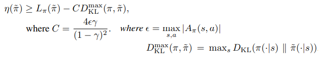 
 

**Algorithm 1** in paper, is guaranteed to generate a monotonically improving sequence of policies.  

___
### 2-4) Optimization of Parameterized Policies  
From theorem 1's result, for improving the true objective "expected discounted rewards", we maximize lower bound, so it is that, 

 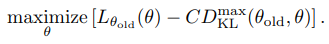 
  
In practice, if we used the penalty coefficient C recommended by the theory above, the step sizes would be very small. One way to take larger steps in a robust way is to use
a constraint on the KL divergence between the new policy and the old policy, i.e., a **trust region constraint:** 

  
  

This problem imposes a constraint that the KL divergence is bounded at every point in the state space.  we can use a heuristic approximation which considers the average KL divergence because this problem is impractical to solve due to the large number of constraints. So the form is rewritten that

 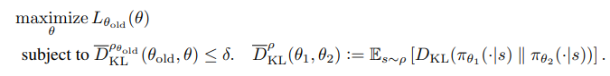 
  

____
### 2-5) Sample-Based Estimation of the Objective and Constraint  
For caculating expected discounted rewards, it uses sampling method for estimating. For exploration, it uses behavior policy to use importance sampling. It replaces advantage function with approximated Q function, and presents expectation form. So the practical form is   

 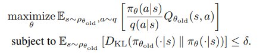 

5.1 Single path, 5.2 Vine are estimation procedure for estimation Q function.  

____
### 2-6) Practical algorithm  
Step 1 and step 2 is used for estimating objective and constraint. **Step 3** explains conjugate gradient algorithm followed by line search for udpating policy.  
**NOTE: With regard to (3), we construct the Fisher information matrix (FIM) by analytically computing the Hessian of the KL divergence, rather than using the covariance  matrix of the gradients.** Appendix C describes how to implement trpo. 

____
### Appendix C: 
It explains how to effectively solve the Trust-Region Constrained Optimization Problem. It uses fisher information matrix for easily calculating kl-divergence's gradient. 
KL-divergence's gradient is presented as  

 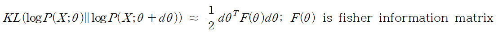 
  

So, kl-divregence's gradient is 

 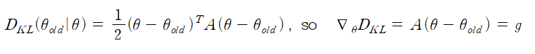 
 

For calculaing x = theta - theta_old, we should calculate (A^-1)g, but it takes long time. So **we use conjugate gradient algorithm for estimating x**.  

By using conjugate gradient algorithm, we can get the search direction s which is approximated x (= (A^-1)g). By the constraints which limits on kl-divergence, 

  
    
The term s^T A s can be computed through a single Hessian vector product, and it is also an intermediate result produced by the conjugate gradient algorithm.  

#### Fisher information matrix and kl-divergence
Fisher information matrix is presented as 

 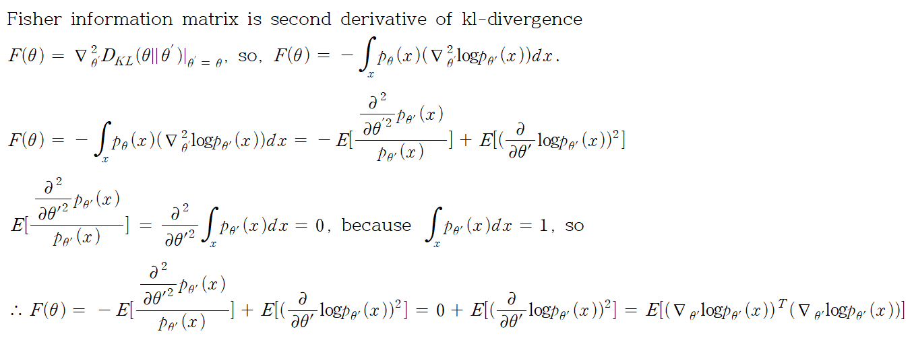 
  

#### Conjugate gradient algorithm: 
It is used to solve Ax = b's solution x for using approximate method.  

 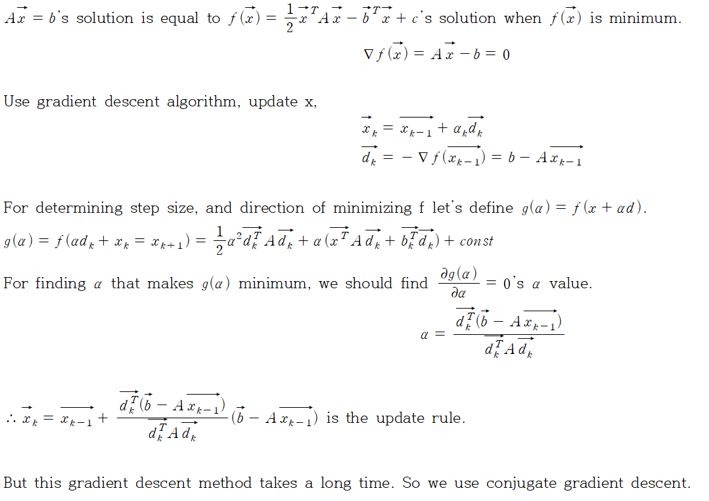 
  

 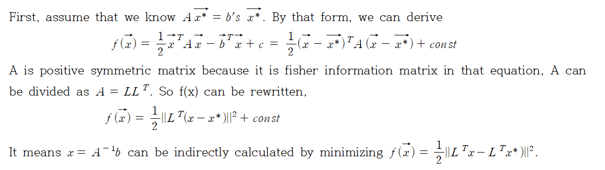 
  

#### Computing the fisher vector product
In this section, it describes how to calculate 'Ax' in Ax = g. 'A' is fisher information matrix. 'A' is presented as

 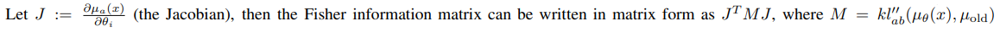 
   
parameterized policy maps from the input x to “distribution parameter” vector µθ(x) which parameterizes the distribution π(u|x).  

In other words, In this paper, they estimate Fisher information matrix, 

 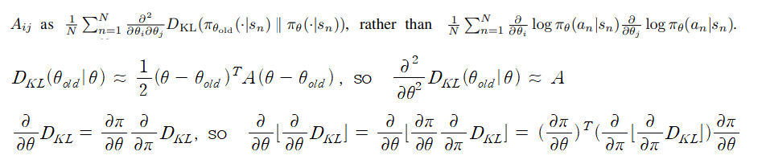 

And using caculated x by conjugated gradient algorithm, 'Ax' is practically estimated by 

 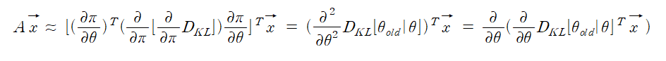 

____
### 2-7) Connection with Prior work  
In this section, it explains natural policy gradient is the special case of trpo policy update. TRPO objective function's linear approximation and a quadratic approximation to the kl-divergence constraint is equal to natural policy gradient.  

 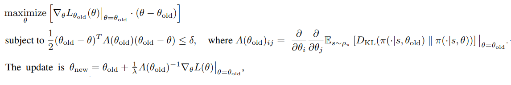 
  
**The difference between natural policy gradient method and TRPO is step size. In case of TRPO, it enforces the constraint at each update. But natural policy gradient use fixed step size.**

# Results

# Reference
* TRPO paper: https://arxiv.org/pdf/1502.05477.pdf  
 
* Approximately Optimal Approximate Reinfor ement Learning:  
    https://people.eecs.berkeley.edu/~pabbeel/cs287-fa09/readings/KakadeLangford-icml2002.pdf   
    https://ieor8100.github.io/rl/docs/Lecture%207%20-Approximate%20RL.pdf  
* Conjugate gradient algorithm: https://joonleesky.github.io/Conjugate_Gradient/  
 
* Fisher vector product: https://www.telesens.co/2018/06/09/efficiently-computing-the-fisher-vector-product-in-trpo/  
 
