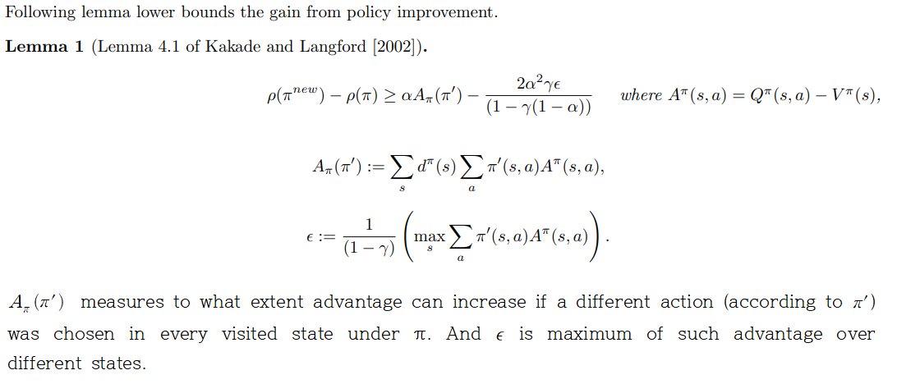
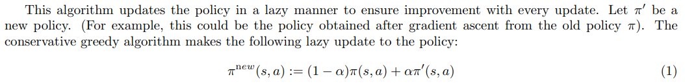
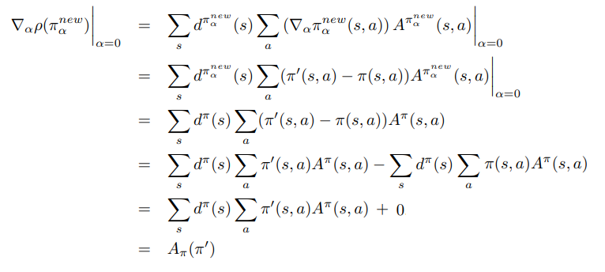
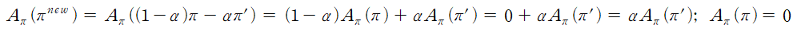
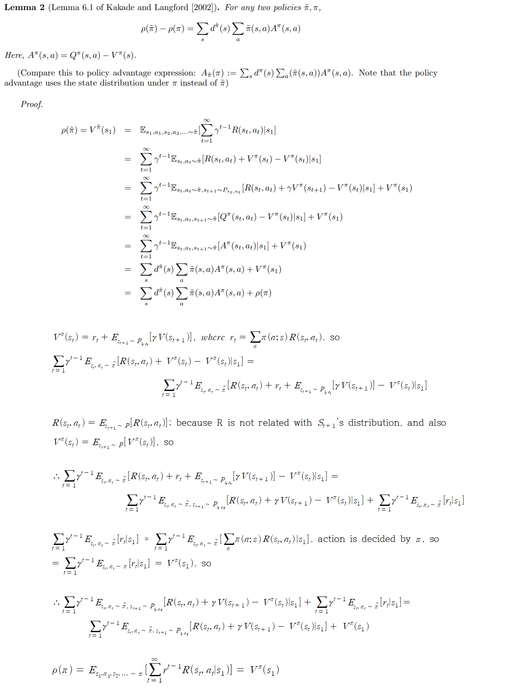
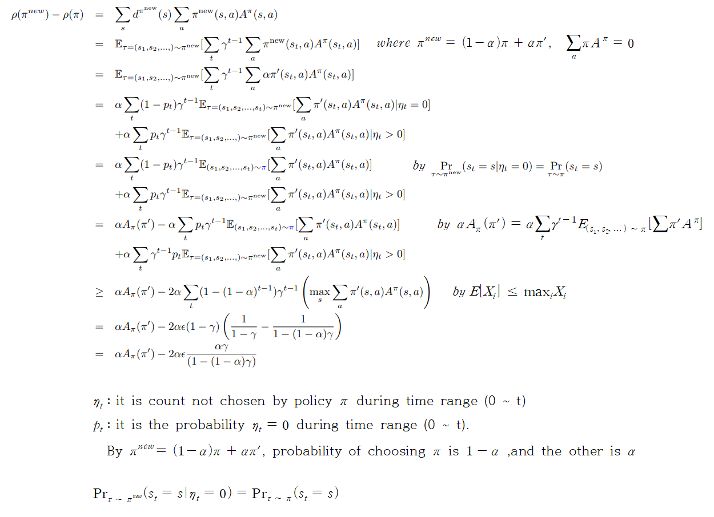
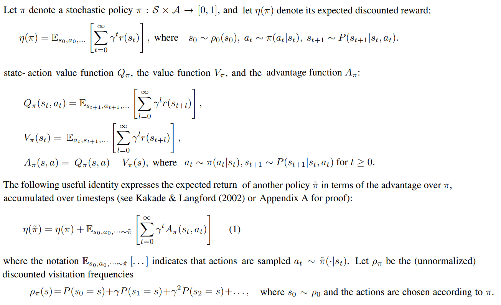
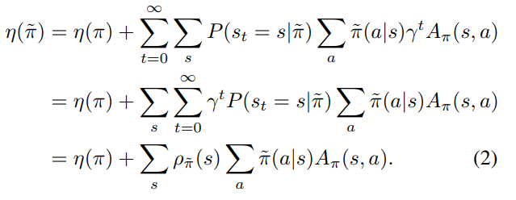

# Summary
## 1. Approximately Optimal Approximate Reinforement Learning:  
It presents lower bound of the difference in reward between policy functions. This form is used in TRPO paper.   

That form is given by quantifying policy improvement.  

  
  

The new policy is defined as  

  
   

By that form, when α = 0, new policy is equal to π and, when α = 1 new policy is equal to π'. And the poliy gradient of new policy when α = 0 is given by  

  
  
By same insight, 

  
  

___
**Lemma 2:** It shows that two differenct policy's expected reward difference is given by  

  
  

Using **lemma 2** for defining lower bound of difference in reward between policy functions, is that  

  
  

## 2. Trust Region Policy Optimization:  
TRPO is similar to natural policy gradient methods and is effective for optimizing large nonlinear policies such as neural networks. 

### Background  
* Terms

  
  

The main idea is kakade's expected return of another policy in terms of the advantage of preveious policy, and it is rewritten as

  
  

By that form, 

# Results

# Reference
TRPO paper: https://arxiv.org/pdf/1502.05477.pdf  
Approximately Optimal Approximate Reinfor ement Learning:  
https://people.eecs.berkeley.edu/~pabbeel/cs287-fa09/readings/KakadeLangford-icml2002.pdf   
https://ieor8100.github.io/rl/docs/Lecture%207%20-Approximate%20RL.pdf
