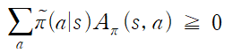
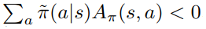

# Summary
## 1. Approximately Optimal Approximate Reinforement Learning:  
It presents lower bound of the difference in reward between policy functions. This form is used in TRPO paper.   

That form is given by quantifying policy improvement.  

  
  

The new policy is defined as  

  
   

By that form, when α = 0, new policy is equal to π and, when α = 1 new policy is equal to π'. And the poliy gradient of new policy when α = 0 is given by  

  
  
By same insight, 

  
  

___
**Lemma 2:** It shows that two differenct policy's expected reward difference is given by  

  
  

Using **lemma 2** for defining lower bound of difference in reward between policy functions, is that  

  
  

## 2. Trust Region Policy Optimization:  
TRPO is similar to natural policy gradient methods and is effective for optimizing large nonlinear policies such as neural networks. In this paper, it uses kakade's paper's core results, and modifies its form to use neural network. Because mixture policy is not practical so, it presents stochastic methods. Policy update form and step size is determined in TRPO, and they are main idea in that paper.  

### Background  
* Terms

  
  

The main idea is kakade's expected return of another policy in terms of the advantage of preveious policy, and it is rewritten as

  
  

By that form,  makes the policy performance increase, but advantage function is approximated, so due
to estimation and approximation error, that there will be some states 's' for which the expected advantage is negative. . So it uses local approximation to expected discounted rewards:  

  
   

By using that form to update policy, we can use its gradient. But there is no guidance on how big of a step to take. **KaKade suggests conservative policy iteration by updating policy with mixture form, and derives lower bound. But that lower bound is only applied to mixture poliy update form!**  

TRPO suggests new update policy rule, not use mixture, but use kl-divergence for expressign updated policy and previous policy's distance. And use it for deriving new form of lower bound and reason of step size. **Theorem 1** shows TRPO deriving new form of lower bound by using kl divergence of updated policy and previous policy.  

# Results

# Reference
TRPO paper: https://arxiv.org/pdf/1502.05477.pdf  
Approximately Optimal Approximate Reinfor ement Learning:  
https://people.eecs.berkeley.edu/~pabbeel/cs287-fa09/readings/KakadeLangford-icml2002.pdf   
https://ieor8100.github.io/rl/docs/Lecture%207%20-Approximate%20RL.pdf
